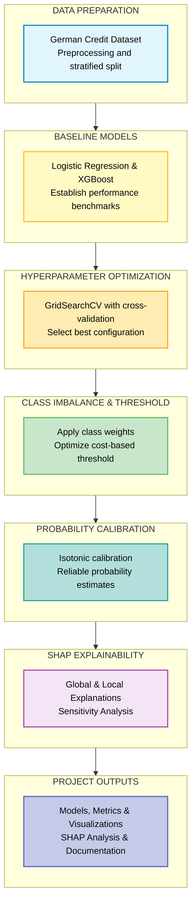

# Credit Scoring Model with SHAP for Interpretability

[](https://www.python.org/downloads/)
[](LICENSE)
[](https://jupyter.org/)
[](https://xgboost.readthedocs.io/)
[](https://shap.readthedocs.io/)

**Author**: Aneesh Chepuri  
**Course**: MSML610 — Fall 2025  
**Project Type**: Credit Risk Modeling with Explainable AI

---

## Overview

A production-ready credit scoring system that combines the predictive power of XGBoost with the transparency of SHAP explanations. This project demonstrates how banks can make accurate lending decisions while satisfying regulatory requirements for explainability and fairness.

Built on the German Credit dataset, the pipeline handles real-world challenges including class imbalance, hyperparameter tuning, probability calibration, and cost-sensitive decision thresholds. Every prediction comes with both global feature importance and borrower-specific explanations.

**Key Achievement**: High-performance model with full explainability, business-optimized thresholds, and calibrated probabilities suitable for regulatory capital planning.

---

## Project Goals

This project builds an end-to-end credit scoring model on the German Credit dataset and uses SHAP (SHapley Additive exPlanations) to interpret model predictions.

### Data Preparation
- Load the German Credit dataset from the UCI ML Repository
- Clean and preprocess data (handle missing values, encode categoricals, scale numericals)
- Split into train/test sets with stratification to maintain class balance

### Modeling
- Train baseline models for performance benchmarking
- Optimize with systematic hyperparameter search using cross-validation
- Handle class imbalance with appropriate weighting techniques
- Apply business logic for cost-sensitive decision thresholds
- Calibrate probabilities for reliable risk estimates

### Interpretability with SHAP
- Compute SHAP values for the optimized model
- Generate global explanations showing feature importance across all predictions
- Create local explanations for individual borrower decisions
- Perform sensitivity analysis to demonstrate feature impact

### Visualization and Reporting
- Generate comprehensive diagnostic plots (confusion matrices, ROC/PR curves, calibration plots)
- Create SHAP visualizations (summary plots, decision plots, dependence plots)
- Produce sensitivity analysis curves showing "what-if" scenarios
- Save all outputs for analysis and reporting

---

## Getting Started

### Prerequisites
- Python 3.8 or higher
- 2GB RAM minimum
- 10 minutes runtime
- Stable internet connection (for dataset download)

---

## Setup Instructions (Local Development)

1. **Clone the Repository**:
   ```bash
   git clone https://github.com/gpsaggese/umd_classes.git
   cd umd_classes/class_project/MSML610/Fall2025/Projects/TutorTask_28_Fall2025_SHAP_Credit_Scoring_Model_with_SHAP_for_Interpretability
   ```

2. **Create and Activate a Virtual Environment (Windows)**:
   ```bash
   python -m venv venv
   venv\Scripts\activate
   ```

3. **Create and Activate a Virtual Environment (macOS/Linux)**:
   ```bash
   python3 -m venv venv
   source venv/bin/activate
   ```

4. **Install Dependencies**:
   ```bash
   pip install -r requirements.txt
   ```

5. **Run Jupyter Notebook Locally**:
   ```bash
   jupyter notebook
   ```
   - Open `SHAP_Credit.API.ipynb` in your browser to understand the APIs
   - Open `shap_example.ipynb` for the full end-to-end pipeline
   - Use **Restart & Run All** for reproducible results

---

## Setup Instructions (Docker)

Docker setup provides a consistent environment across all platforms and is the **recommended approach** for this project.

1. **Install Docker Desktop** for your operating system from [docker.com](https://www.docker.com/products/docker-desktop/).

2. **Navigate to the project directory**:
   ```bash
   cd ~/umd_classes/class_project/MSML610/Fall2025/Projects/TutorTask_28_Fall2025_SHAP_Credit_Scoring_Model_with_SHAP_for_Interpretability
   ```

3. **Build the Docker Image**:
   ```bash
   chmod +x docker_*.sh
   ./docker_build.sh
   ```

4. **Start the Container and Jupyter Notebook Server**:
   ```bash
   ./docker_bash.sh
   ```
   - This starts a container, mounts the current project as `/workspace`, and launches Jupyter
   - The Jupyter notebook server automatically loads for immediate access

5. **Open Jupyter in your browser**:
   ```
   http://localhost:8888
   ```
   - You should see `SHAP_Credit.API.ipynb`, `shap_example.ipynb`, and the `credit_scoring_shap/` package
   - Start with `SHAP_Credit.API.ipynb` to learn the APIs
   - Run `shap_example.ipynb` for the complete pipeline

---

## Project Structure

```
TutorTask_28_Fall2025_SHAP_Credit_Scoring_Model_with_SHAP_for_Interpretability/
│
├── README.md                           # This file
├── SHAP_Credit.API.md                  # API documentation
├── SHAP_Credit.example.md              # Complete walkthrough with detailed metrics
├── SHAP_Credit.API.ipynb               # API tutorial notebook
├── shap_example.ipynb                  # Main pipeline notebook
│
├── credit_scoring_shap/                # Python package
│   ├── __init__.py
│   ├── config.py                       # Configuration with random seeds
│   ├── data.py                         # Data loading and preprocessing
│   ├── modeling.py                     # Model building and training
│   ├── evaluation.py                   # Metrics and visualization
│   ├── explain.py                      # SHAP analysis
│   └── sensitivity.py                  # Sensitivity analysis
│
├── reports/                            # Generated outputs
│   ├── baseline_lr_*.png               # Logistic regression plots
│   ├── baseline_xgb_*.png              # Baseline XGBoost plots
│   ├── tuned_xgb_*.png                 # Tuned model plots
│   ├── balanced_xgb_*.png              # Balanced model plots
│   ├── calibration_*.png               # Calibration plots
│   ├── shap_*.png                      # SHAP visualizations
│   ├── sensitivity_*.png               # Sensitivity curves
│   └── metrics_*.txt                   # Metric summaries
│
├── requirements.txt                    # Python dependencies
├── Dockerfile                          # Docker configuration
├── docker_build.sh                     # Build Docker image
├── docker_bash.sh                      # Run Docker container
├── run_jupyter.sh                      # Start Jupyter server
│
├── bashrc                              # Shell config
├── etc_sudoers                         # Sudo configuration
├── install_common_packages.sh          # System dependencies
├── install_jupyter_extensions.sh       # Jupyter extensions
├── utils.sh                            # Helper utilities
└── version.sh                          # Version management
```

---

## Pipeline Workflow



---

## How It Works

The pipeline operates through a comprehensive multi-step process organized into seven major sections:

### 1. Data Preparation
- Loads German Credit dataset from UCI repository using `ucimlrepo`
- Handles missing values and data quality issues
- Applies one-hot encoding to categorical features
- Standardizes numerical features for model compatibility
- Creates stratified train/test splits maintaining class distribution

### 2. Baseline Model Training
- Trains Logistic Regression as performance benchmark
- Trains XGBoost with default parameters for comparison
- Evaluates both models using multiple metrics
- Generates diagnostic visualizations (confusion matrices, ROC curves)
- Establishes baseline performance for improvement measurement

### 3. Hyperparameter Optimization
- Defines comprehensive parameter grid covering key hyperparameters
- Performs stratified cross-validated grid search
- Evaluates all configurations systematically
- Selects best configuration based on validation performance
- Tests optimized model on held-out test set

### 4. Class Imbalance Handling
- Analyzes class distribution in training data
- Calculates appropriate class weights
- Trains balanced model with adjusted sample weights
- Evaluates impact on minority class detection
- Analyzes trade-offs between precision and recall

### 5. Cost-Based Threshold Optimization
- Defines business costs for different error types
- Sweeps through possible decision thresholds
- Calculates expected cost at each threshold
- Selects threshold minimizing total business cost
- Evaluates resulting error distribution

### 6. Probability Calibration
- Applies isotonic calibration method
- Performs cross-validated calibration
- Validates calibration quality using Brier score
- Generates calibration plots for visual assessment
- Ensures probabilities are reliable for downstream use

### 7. SHAP Explainability and Sensitivity Analysis
**Global Analysis**
- Computes SHAP values across entire dataset
- Identifies most important features driving predictions
- Generates summary plots showing feature impact distribution
- Creates dependence plots revealing feature interactions

**Local Analysis**
- Explains individual borrower decisions
- Produces decision plots showing cumulative feature contributions
- Maps SHAP values to human-readable reason codes
- Supports adverse action notices for regulatory compliance

**Sensitivity Analysis**
- Identifies top features for selected borrowers
- Varies features systematically while holding others constant
- Plots prediction changes across feature ranges
- Reveals actionable insights for borderline cases

---

## Key Features

### Production-Ready ML Pipeline
- Baseline models for benchmarking
- Systematic hyperparameter tuning with cross-validation
- Class imbalance handling with sample weighting
- Cost-sensitive threshold optimization
- Probability calibration for reliable estimates

### Explainability with SHAP
- Global feature importance rankings
- Individual decision explanations with reason codes
- Sensitivity analysis for "what-if" scenarios
- Regulatory compliance support with audit trails

### Comprehensive Evaluation
- Multiple performance metrics (AUC, Precision-Recall, Brier Score)
- Rich visualization suite (confusion matrices, ROC/PR curves, calibration plots)
- Business impact analysis across different thresholds
- Framework for fairness testing and disparate impact analysis

### Risk Management Integration
- Calibrated probability estimates suitable for capital planning
- Stress testing capabilities via sensitivity analysis
- Model monitoring framework for drift detection
- Deployment guidelines and operational recommendations

---

## Usage

### Understanding the APIs
```bash
jupyter notebook SHAP_Credit.API.ipynb
```
This notebook demonstrates:
- XGBoost API for gradient boosted tree models
- SHAP API for model interpretation and explainability
- Project package structure and module organization
- Best practices for using the credit scoring pipeline

### Running the Full Pipeline
```bash
jupyter notebook shap_example.ipynb
```
The complete end-to-end pipeline:
- Loads and preprocesses German Credit dataset
- Trains baseline and optimized models
- Handles class imbalance systematically
- Optimizes decision thresholds for business costs
- Calibrates probabilities for reliable risk estimates
- Generates comprehensive SHAP explanations
- Performs sensitivity analysis on key features
- Saves all outputs to reports directory

### Best Practices
- Use **Restart & Run All** in Jupyter for fully reproducible results
- Review generated outputs in `reports/` directory after execution
- Start with API notebook if new to XGBoost or SHAP frameworks
- Consult `SHAP_Credit.example.md` for detailed metrics and analysis
- Check configuration in `credit_scoring_shap/config.py` before running

---

## What You'll Learn

### Machine Learning Fundamentals
- Baseline model establishment and performance benchmarking
- Hyperparameter optimization with grid search and cross-validation
- Strategies for handling imbalanced classification problems
- Advanced model evaluation beyond simple accuracy metrics
- Probability calibration methods for reliable predictions

### Explainable AI Techniques
- SHAP value theory and practical implementation
- Difference between global and local explanations
- Interpreting decision plots and waterfall charts
- Conducting sensitivity analysis for feature impact
- Translating technical explanations to business language

### Risk Management Applications
- Cost-sensitive threshold optimization for business objectives
- Expected loss calculations using probability estimates
- Stress testing approaches using feature-based scenarios
- Model monitoring strategies for production deployment
- Frameworks for regulatory compliance and fairness testing

### Software Engineering Practices
- Modular code architecture with clear separation of concerns
- Configuration-driven development for maintainability
- Reproducible experiments using random seed management
- Docker containerization for consistent environments
- Professional documentation and visualization standards

---

## Troubleshooting

### Port Already in Use
If port 8888 is occupied:
```bash
sudo lsof -i :8888
sudo kill -9 <PID>
```

### Module Not Found Error
Ensure you are running inside the Docker container started by `docker_bash.sh`. The container should have `/workspace` mounted to the current project directory.

### Dataset Download Issues
The dataset is automatically fetched from UCI repository via `ucimlrepo`. If download fails:
- Check internet connectivity inside the container
- Verify firewall settings allow outbound connections
- Manually download dataset and update `config.py` to use local file

### Reproducibility Issues
All random seeds are set to 42 throughout the project for reproducibility. If results differ across runs:
- Verify you are using the Docker environment (ensures consistent library versions)
- Check that notebooks initialize seeds at the beginning
- Confirm `random_state=42` is set in all relevant function calls
- For maximum reproducibility, use `n_jobs=1` in GridSearchCV (slower but deterministic)

### Visualization Problems
If plots do not display in Jupyter notebooks:
- Add `%matplotlib inline` magic command at the start of notebooks
- Verify matplotlib and seaborn are properly installed
- Check that `reports/` directory exists and has write permissions
- Update visualization libraries: `pip install --upgrade matplotlib seaborn`

### Memory Issues
If encountering out-of-memory errors:
- Reduce parameter grid size for GridSearchCV
- Use smaller sample for initial testing
- Increase Docker memory allocation in Docker Desktop settings
- Consider using incremental learning approaches for large datasets

---

## References

### Core Libraries
- [XGBoost Documentation](https://xgboost.readthedocs.io/) - Gradient boosting framework
- [SHAP Documentation](https://shap.readthedocs.io/) - Model interpretation library
- [scikit-learn Documentation](https://scikit-learn.org/stable/) - Machine learning toolkit
- [ucimlrepo Documentation](https://pypi.org/project/ucimlrepo/) - UCI dataset access

### Dataset
- [German Credit (Statlog) – UCI Machine Learning Repository](https://archive.ics.uci.edu/dataset/144/statlog+german+credit+data)

### Research Papers
- Chen, T., & Guestrin, C. (2016). [XGBoost: A Scalable Tree Boosting System](https://arxiv.org/abs/1603.02754). Proceedings of the 22nd ACM SIGKDD International Conference on Knowledge Discovery and Data Mining.
- Lundberg, S. M., & Lee, S. I. (2017). [A Unified Approach to Interpreting Model Predictions](https://arxiv.org/abs/1705.07874). Advances in Neural Information Processing Systems.

### Key APIs and Methods
- [GridSearchCV](https://scikit-learn.org/stable/modules/generated/sklearn.model_selection.GridSearchCV.html) - Hyperparameter optimization
- [train_test_split](https://scikit-learn.org/stable/modules/generated/sklearn.model_selection.train_test_split.html) - Data splitting
- [CalibratedClassifierCV](https://scikit-learn.org/stable/modules/generated/sklearn.calibration.CalibratedClassifierCV.html) - Probability calibration
- [ROC AUC Score](https://scikit-learn.org/stable/modules/generated/sklearn.metrics.roc_auc_score.html) - Model evaluation
- [Confusion Matrix](https://scikit-learn.org/stable/modules/generated/sklearn.metrics.confusion_matrix.html) - Error analysis

---

## License

This project is licensed under the MIT License. See LICENSE file for details.

---

## Acknowledgments

- **Dataset**: UCI Machine Learning Repository for providing the German Credit dataset
- **XGBoost**: Chen & Guestrin for the gradient boosting framework
- **SHAP**: Lundberg & Lee for the explainability methodology
- **Course**: MSML610 - Machine Learning, University of Maryland
- **Instructor**: Professor GP Saggese for guidance and support
